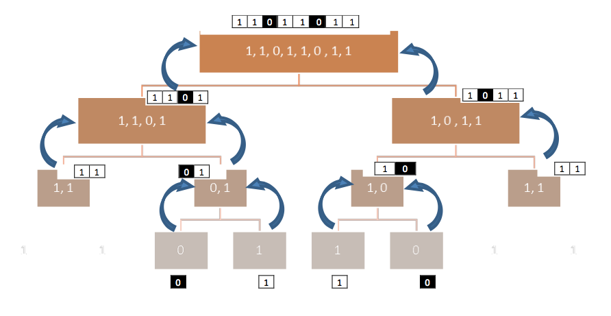

# Defective Lightbulbs: A Multithreaded Approach

Consider a series of lightbulbs connected in a sequential manner. In this situation, if one of the bulbs is defective, it will cause all the bulbs to be off. A solution to find quickly the faulty bulb(s) is to recursively divide the series into subseries and keep investigating the subseries that do not show light, assuming the subseries with no faulty bulb(s) will show light.

## Objectives

Create a recursive threading method to find the location of any defective bulb(s) and the number of threads that have been created for this purpose. The input will consist of the status of each bulb:

- 0 to indicate the bulb is defective
- 1 to indicate the bulb is functioning properly

## Program Flow Diagram

